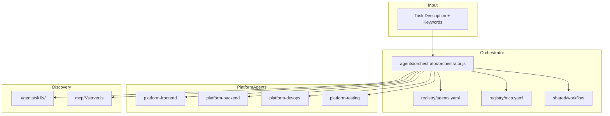

# Teknovo Multi-Agent Platform Architecture

## Overview

## Task Flow

1. **Ingress** — Task arrives with description and optional keywords/domain
2. **Route** — Orchestrator scores agents in `registry/agents.yaml` by keyword match
3. **Discover** — Skills from `.agents/skills/`, MCPs from `mcp/` and `registry/mcp.yaml`
4. **Dispatch** — Primary agent selected; alternates available for parallel work
5. **Execute** — `shared/workflow` runs steps with up to 10 retries (execution-registry)
6. **Recover** — Failed steps retry per `execution/failure-recovery.md`

## Agent Types

| Type | Examples | Role |
|------|----------|------|
| platform | orchestrator, frontend, backend, devops, testing | Domain specialists |
| review | taste, security, impeccable | Quality gates |
| assurance | requirement-clarifier, context-builder | Pre-implementation |
| pillar | chief-product-designer, chief-architect, devops-engineer | Teknovo Three Pillars |

## MCP Integration

| Server | Secret Path | Risk |
|--------|-------------|------|
| github-mcp | `github.env` → GITHUB_TOKEN | high |
| cloudflare-mcp | `cloudflare.env` | critical |
| filesystem-mcp | none | medium |
| git-mcp | none | medium |

## Shared Libraries

- **secret-store** — Wraps `mcp/shared/secrets.js` with platform status API
- **logging** — Structured JSON logs with secret masking
- **validation** — Zod schemas for tasks and workflow steps
- **workflow** — Step runner with retry and parallel coordination

## Registry Split

| File | Role |
|------|------|
| `registry/agents.yaml` | Platform + reviewer agents |
| `registry/skills.yaml` | Index to canonical skill-registry.yaml |
| `registry/mcp.yaml` | MCP tools, secret paths, risk levels |
| `registry/agent-registry.yaml` | Legacy full agent map |
| `registry/mcp-registry.yaml` | Legacy full MCP map |

## Failure Recovery

Aligned with `execution/execution-registry.yaml`:

- `max_retries: 10`
- `stop_on_first_failure: false` for workflow steps
- Orchestrator uses `shared/workflow/WorkflowEngine`

## Security

- No secrets in code or logs
- MCP write operations require security-reviewer APPROVE
- Secret store paths: `/root/.config/teknovo/secrets/` (Linux)
